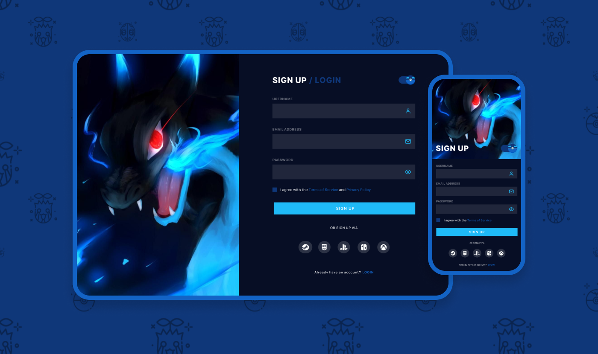
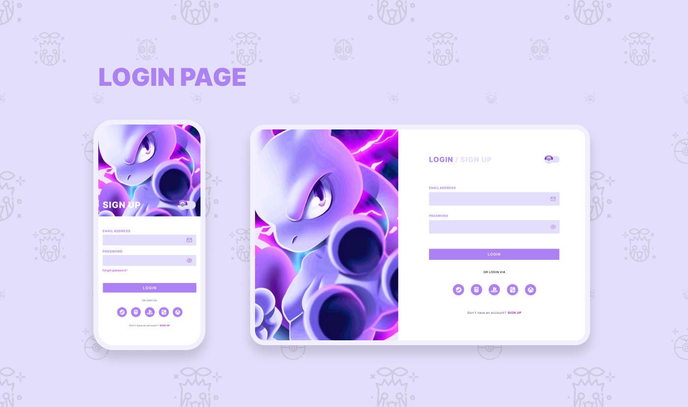
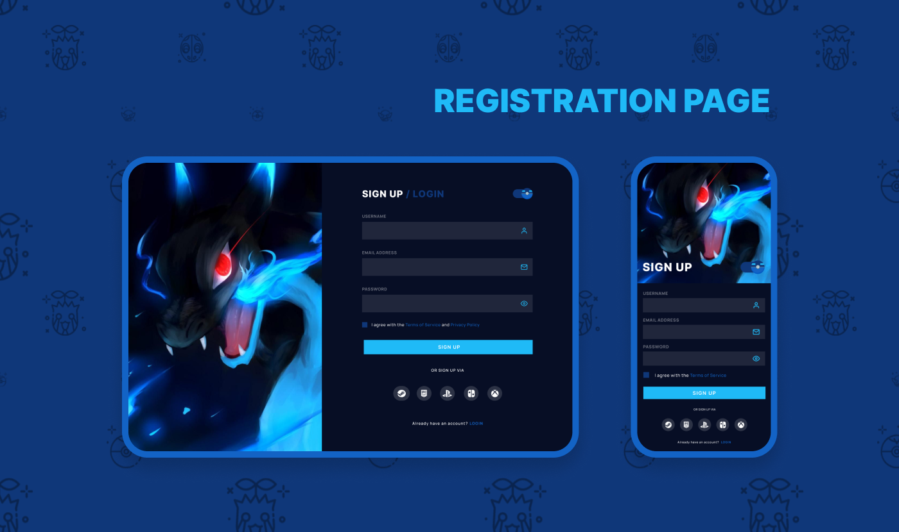
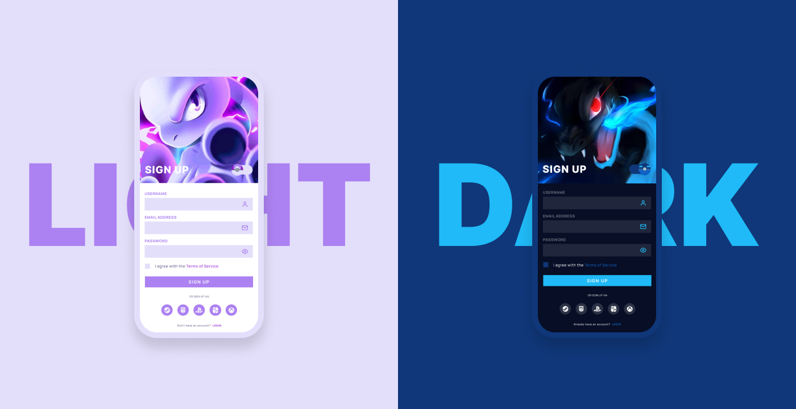

<h1> Pokémon Login/Sign up Page </h1>

This is a Login and Sign up page for a Pokémon Game with a simple and minimalist design.

 

  <a href="#-technologies">Technologies</a>&nbsp;&nbsp;&nbsp;|&nbsp;&nbsp;&nbsp;
  <a href="#-project">Project</a>&nbsp;&nbsp;&nbsp;|&nbsp;&nbsp;&nbsp;
  <a href="#-layout">Layout</a>&nbsp;&nbsp;&nbsp;|&nbsp;&nbsp;&nbsp;

 

  

# 🚀 Technologies

This project was developed with the following technologies:

- HTML, CSS & JavaScript
- Git & GitHub

 

# 💻 Project

This is a Login & Sign up page for a Pokémon Game with a simple and minimalist design.
The pages are made using a light and a dark mode. The Light mode was based on a color palette extracted from the legendary Pokémon Mewtwo and the dark mode was made from a color palette extracted from Pokémon Mega Charizard.

 

# 🔖 Layout

### It containes both the Login and the Sign Up page

  
  

### The page also have two different themes, Light & Dark

 

  

 

You can view the entire layout of the project through [THIS LINK](https://www.figma.com/file/yfsZp24aQGs2ZNuNwl6Qj5/Social-links?node-id=120%3A19&t=Moa0T9233uEyYYXK-1). You need an account on [Figma]([https://figma.com](https://www.figma.com/file/TjGDl95lGwyhn3DuCjTYX1/Pok%C3%A9mon-Login%2FRegister?node-id=0%3A1&t=VM9M3CHLhzZs2r4H-1)) to access it.

---

Made with ♥ by Danildo Silva :wave: [Connect with me!](https://www.linkedin.com/in/danildosilva/)
